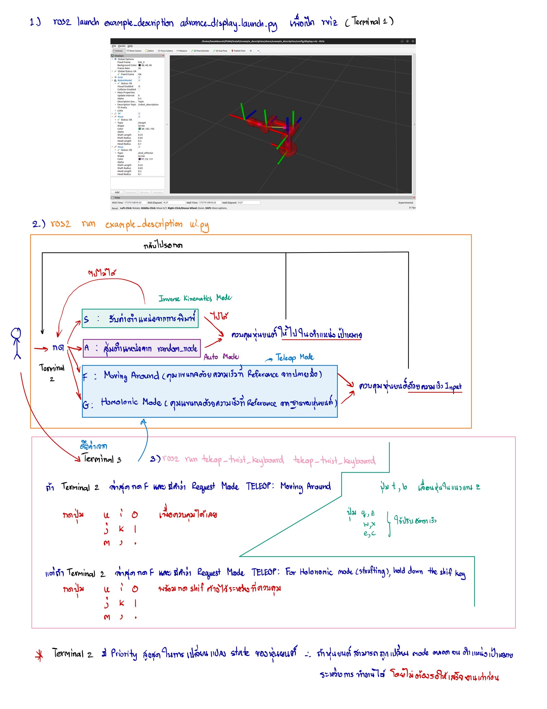

# Hello World 3R Manipulator

A simulation system of a 3R robotic arm that does not take into account collisions and forces, controlled via CLI and displayed via RVIZ.


## Features

- Can be run by opening only 3 files.
- Arrows indicate the position of the End-effector (purple) and the Target position (green).
- Every step of the work process is displayed with logs, supporting Exception Handling.
- Supports 3 working modes: Auto, Inverse, Teleop


## Installation

**Install ROS2 Humble**

[Install ROS 2 packages](https://docs.ros.org/en/humble/Installation/Ubuntu-Install-Debs.html)

**Install dependencies**

```bash
    pip3 install numpy==1.24.4
    pip3 install roboticstoolbox-python
    sudo apt install ros-humble-desktop-full
    sudo apt install ros-dev-tools
```

Go somewhere like your home directory and clone this package.

```bash
    git clone https://github.com/beamkeerati/FUN4
    cd FUN4/
```
then build (inside FUN4)

```bash
    colcon build && . install/setup.bash
```
Set up your environment by sourcing the following file.

```bash
    echo "source ~/FUN4/install/setup.bash" >> ~/.bashrc
```
## Usage

The rough usage method is as follows:



**Open 3 Terminals in order and leave them running so that all three can run simultaneously.**

**Terminal 1**
```bash
    ros2 launch example_description advance_display.launch.py
```
**Terminal 2**
```bash
    ros2 run example_description ui.py
```
**Terminal 3**
```bash
    ros2 run teleop_twist_keyboard  teleop_twist_keyboard
```