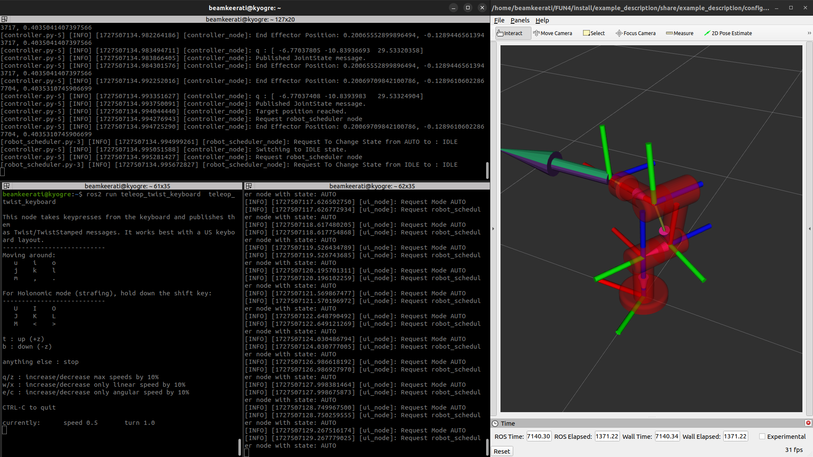

# Hello World 3R Manipulator

A simulation system of a 3R robotic arm that does not take into account collisions and forces, controlled via CLI and displayed via RVIZ.



## Installation

Install dependencies

```bash
  pip3 install numpy==1.24.4
  pip3 install roboticstoolbox-python
  sudo apt install ros-humble-desktop-full
```
Clone this package

```bash
  pip3 install numpy==1.24.4
  pip3 install roboticstoolbox-python
  sudo apt install ros-humble-desktop-full
```